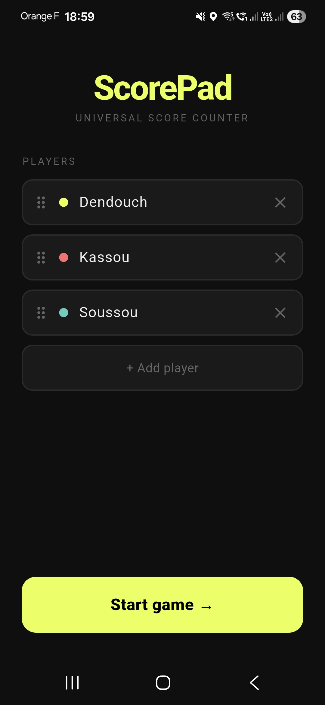
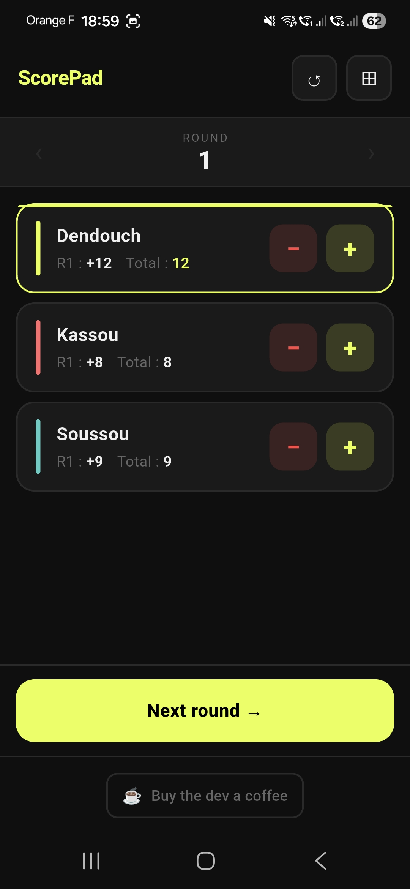
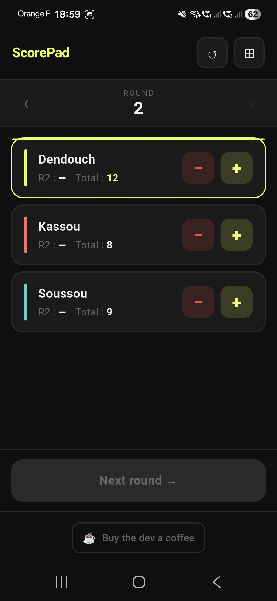

# ScorePad

A free, simple score counter for any board game or card game. No ads, no account, no internet required.

---

  
  &nbsp;&nbsp;
  
  &nbsp;&nbsp;
  

---

## Features

- **Any game** — works for Belote, Uno, Catan, Skyjo, or whatever you play
- **Round by round** — scores are entered per round, browse past rounds anytime
- **Running totals** — always know who's winning at a glance
- **Up to 8 players** — drag to reorder, each player gets a color
- **Persistent** — close the app mid-game and resume exactly where you left off
- **Dark theme** — easy on the eyes at the table

## Download

*Coming soon on Google Play.*

## Built with

- [Flutter](https://flutter.dev)
- [sqflite](https://pub.dev/packages/sqflite) for local persistence
- [Google Fonts](https://pub.dev/packages/google_fonts) — Syne + JetBrains Mono

## Support

If you find the app useful, you can [buy me a coffee ☕](https://buymeacoffee.com/kassoum)

## License

MIT
